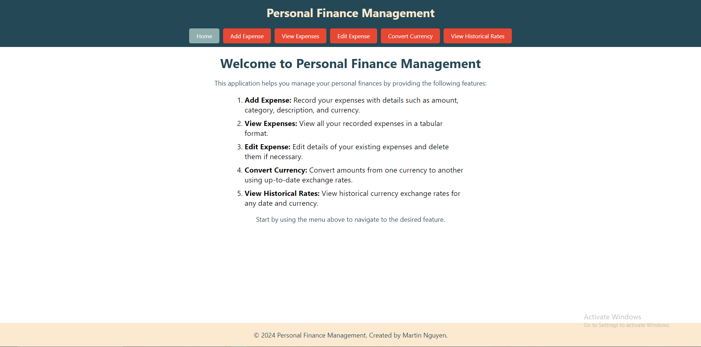
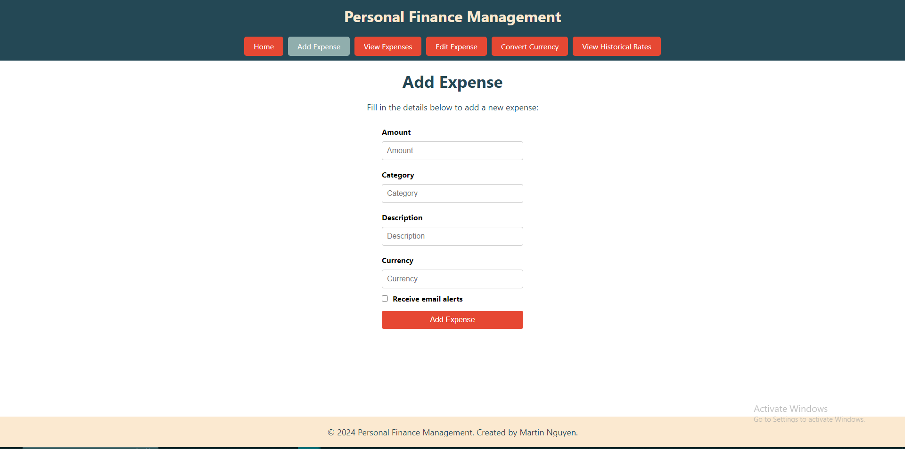
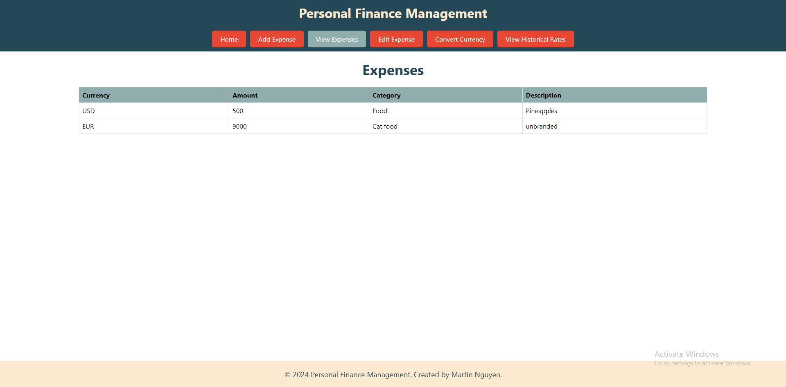
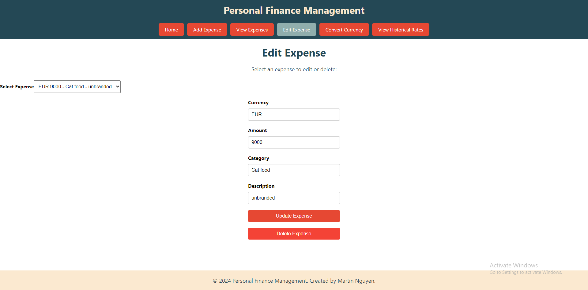
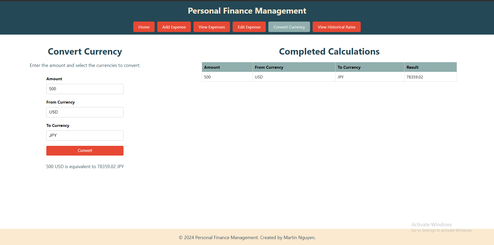
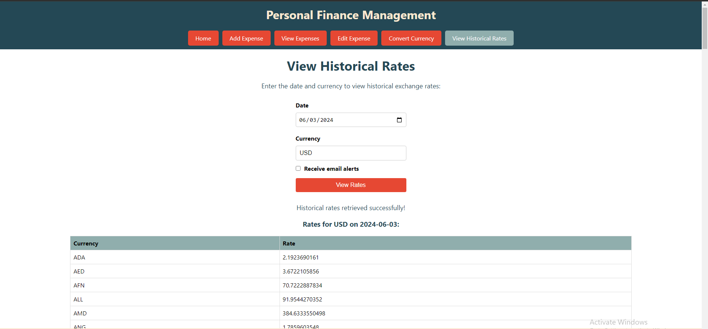

# Personal Finance Management Microservice Project v2

## Overview

Personal Finance Management is a comprehensive application designed to help users efficiently manage their personal finances. The application provides features such as expense tracking, currency conversion, and viewing historical currency rates, making it easier for users to keep track of their spending, make informed financial decisions, and stay updated with currency fluctuations.

## Table of Contents

- [Features](#features)
- [Microservices](#microservices)
- [Getting Started](#getting-started)
- [Usage](#usage)
- [License](#license)
- [Contributors](#contributors)

## Features

1. **Expense Management**:
   - Add new expenses with details such as amount, category, description, currency, and an optional email for alerts.
   - View all expenses in a tabular format.
   - Edit existing expenses.
   - Delete unnecessary expense entries.
   - Receive email notifications for added expenses.

2. **Currency Conversion**:
   - Convert amounts from one currency to another using the latest conversion rates.
   - Simple input form to enter the amount, base currency, and target currency.

3. **Viewing Historical Rates**:
   - View historical currency rates for a given date and base currency.
   - Option to receive historical rates via email.

## Microservices

This project uses a microservice architecture with the following services:

1. **Expense Service**:
   - Handles the addition, viewing, editing, and deletion of expenses.
   - Sends email alerts using the Email Service.

2. **Email Service**:
   - Sends email notifications for added expenses and historical rates.

3. **Historical Rates Service**:
   - Fetches historical currency rates from an external API.

4. **Currency Conversion Service**:
   - Performs currency conversions using the latest exchange rates from an external API.

## Getting Started

### Prerequisites

- Python 3.8+
- Flask
- Requests
- Flask-CORS
- Axios (for frontend)
- React (for frontend)

### Installation
1. **Run expense_service.py**:

2. **Run  email_service.py**:

3. **Run historical_rates_service.py**:

4. **Run currency_conversion_service.py**:
  
5. **Start the frontend: npm start**:

## Screenshots

### Screenshot 1

### Screenshot 2

### Screenshot 3

### Screenshot 4

### Screenshot 5

### Screenshot 6

### Note
Need to add your own email and password to email_service.py and currencyapi.com key to historical_rates_service.py

